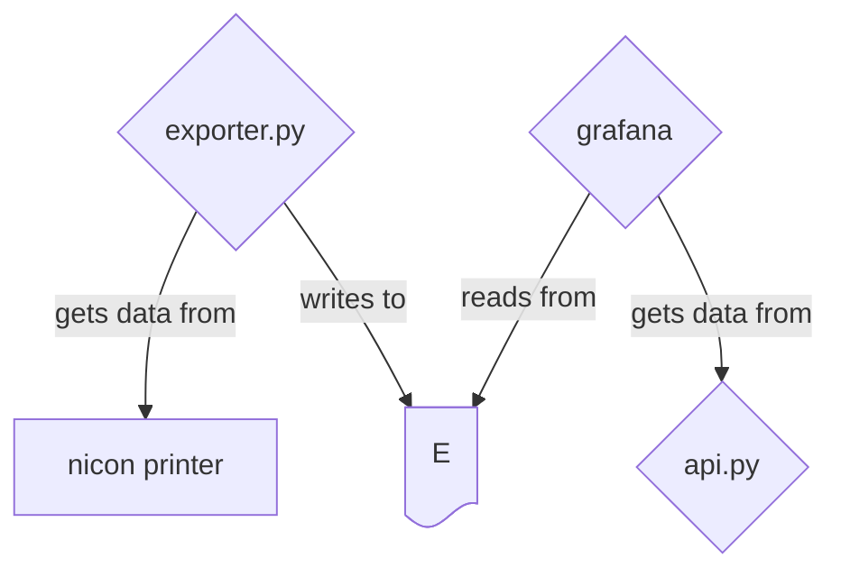

# opc ua client connection for birex nicon machine

Proof of concept to extract and visualize data exposed from a nicon printer using opcua

## Structure

The poc exists inside `python-graphana-export` directory, is made up by 3 services

- a python script to get data from the nicon machine
- a python api endpoint to expose data
- a grafana instance to make dashboard out of the api data


> [!NOTE]
> all services are deployed using docker and docker compose 🐳


# how to run

Connect to Birex `openvpn` server

```bash
nmcli connection up birex
```

Create virtual environment

```bash
python -m venv env
```

Install dependencies

```bash
source env/bin/activate
pip install -r requirements.txt
```

Run `client-test.py`

```bash
python get_all_nodes.py
```

## Connection keys and certificates problems

The function:

```python
client.set_security_string(f"Aes128Sha256RsaOaep,SignAndEncrypt,{os.path.join('certs','own','uaexpert.der')},{os.path.join('certs','own','uaexpert_key.pem')},{os.path.join('certs','server','nikonslm.birex.der')}")
```

Needs the certificate files inside the certs dir as follows:

```text
certs
├── own
│   ├── uaexpert.der
│   └── uaexpert_key.pem
└── server
    └── nikonslm.birex.der
```

## `application_uri` variable problems

The library present itself with a default application uri wich is not suited for certificates generated by uaexpert client, the script changes the variable value to:

```python
client.application_uri= f'urn:{socket.gethostname()}:UnifiedAutomation:UaExpert'
```
