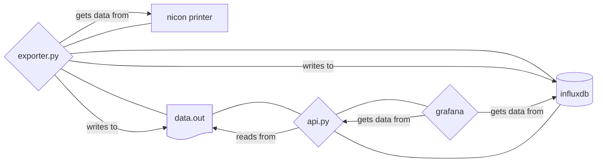

# Poc of birex nicon printer data extraction

Proof of concept to extract and visualize data exposed from a nicon printer using opcua

## Structure

The poc exists inside `python-graphana-export` directory, is made up by 3 services

- a python script to get data from the nicon machine
- a python api endpoint to expose data
- a grafana instance to make dashboard out of the api data


> [!NOTE]
> all services are deployed using docker and docker compose 🐳

## Test Poc on localhost

> [!WARNING]
> To test Poc is necessary to have a access to birex vpn in order to connect to the nicon printer

- copy certificate inside the `python-grafana-export` directory following this scheme

```text
certs
├── own
│   ├── uaexpert.der
│   └── uaexpert_key.pem
└── server
    └── nikonslm.birex.der
```

- create a `.env` file inside  `python-grafana-export` and setup variable content

```bash
grep -e '- [A-Za-z0-9_]*=\${[A-Za-z0-9_]*}' python-grafana-export/docker-compose.yml  | awk -F'=' '{print $1}' | awk -F'-' '{print $2}' > python-grafana-export/.env
```

- Enter inside the directory and run docker compose

```bash
cd python-grafana-export
# build to avoid old builds
docker compose build
docker compose up
```

- configure the infinity data source inside grafana to pull from `http://python_grafana_export_api:8080`

- import `dashboard.json` file inside `grafana` container

### Connection keys and certificates problems

The function:

```python
client.set_security_string(f"Aes128Sha256RsaOaep,SignAndEncrypt,{os.path.join('certs','own','uaexpert.der')},{os.path.join('certs','own','uaexpert_key.pem')},{os.path.join('certs','server','nikonslm.birex.der')}")
```

Needs the certificate files inside the certs dir as follows:

```text
certs
├── own
│   ├── uaexpert.der
│   └── uaexpert_key.pem
└── server
    └── nikonslm.birex.der
```

### `application_uri` variable problems

The library present itself with a default application uri wich is not suited for certificates generated by uaexpert client, the script changes the variable value to:

```python
client.application_uri= f'urn:{socket.gethostname()}:UnifiedAutomation:UaExpert'
```


### Export metrics list

To export all possible metrics exposed from the opc-ua server of the machine run the following script

```python
import asyncio
import socket
import os
import json
from asyncua import Client
from asyncua import Node
from asyncua.common.ua_utils import val_to_string
from asyncua.common.utils import NotEnoughData
from asyncua.ua.uaerrors import BadAttributeIdInvalid
from asyncua.ua.uaerrors._auto import BadUserAccessDenied

ID_TO_LOOK_FOR_DATA = [ 'i=85']

async def main():
    nicon_address='192.168.102.10'
    nicon_port='4840'
    client = Client(url=f'opc.tcp://{nicon_address}:{nicon_port}')
    # fix this parameters
    client.application_uri= f'urn:{socket.gethostname()}:UnifiedAutomation:UaExpert'
    await client.set_security_string(f"Aes128Sha256RsaOaep,SignAndEncrypt,{os.path.join('certs','own','uaexpert.der')},{os.path.join('certs','own','uaexpert_key.pem')},{os.path.join('certs','server','nikonslm.birex.der')}")
    try:
        await client.connect()

        for id in ID_TO_LOOK_FOR_DATA:
            node = client.get_node(id)
            await explore_get_values(node)
    finally:
        await client.disconnect()

async def explore_get_values(node: Node):

    try:
        browse_name = await node.read_browse_name()
        out_node ={ "node_id": node.nodeid.to_string(),"browse_name": browse_name}
        print(out_node)

    except BadAttributeIdInvalid:
        print(f"no attribute for {node}")
    except BadUserAccessDenied:
        print(f"no permission error for {node}")
    except NotEnoughData:
        print(f"not enough data error for {node}")

    # recursion
    childrens = await node.get_children()
    if  len(childrens) != 0:
        for child in childrens:
            await explore_get_values(child)

asyncio.run(main())
```

Then run it with:

```bash
python script.py | tee metrics.txt
```

Metrics informations are stored inside `metrics.md`
